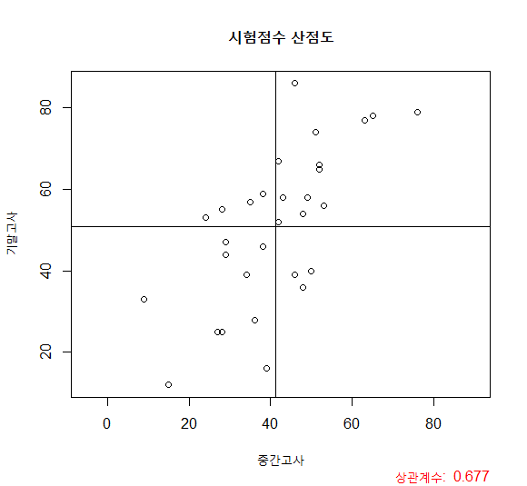
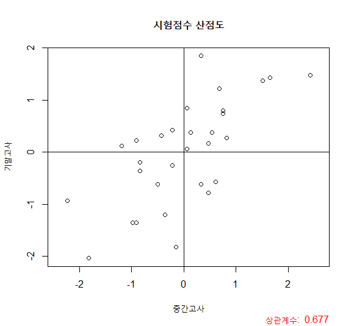
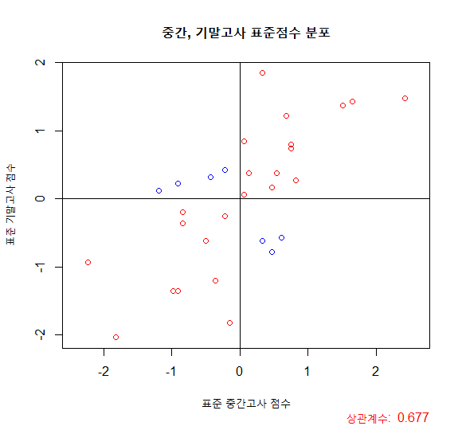
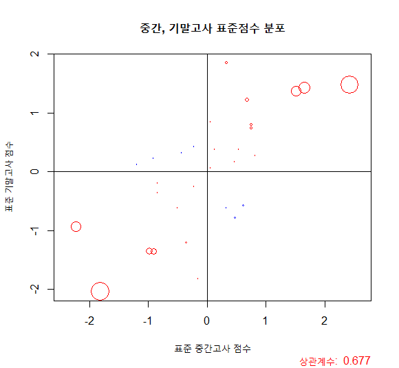

# 상관계수 (correlation coefficient)

- [상관계수 공식](https://www.theissaclee.com/ko/courses/rstat101/week5/) - s 는 표본 표준편차이다.

1. 상관계수는 두 변수의 선형적인 관계를 측정하는 지표이다
2. 결과값은 -1과 1 사이 값이다
3. r이 양수, 음수에 따라 양의 상관 관계, 음의 상관 관계라고 보며 0에 가까울수록 선형 상관 관계가 존재하지 않음을 보인다. 방향성을 나타낸다.
4. r이 0인 경우 두 변수 사이 관계가 존재하지 않음을 나타내는 것이 아니라 다른 관계가 존재할 수 있다
5. 단위가 존재하지 않는다

### 상관계수 값에 따른 변화


## R 코드로 상관계수 구하기

```R
x_bar <- mean(mydata$midterm) # 평균
y_bar <- mean(mydata$final)
s_x <- sd(mydata$midterm) # 표준편차
s_y <- sd(mydata$final)

# 공식 계산 과정
z_x <- (mydata$midterm - x_bar) / s_x
z_y <- (mydata$final - y_bar) / s_y
sum(z_x * z_y) / (length(mydata$student_id) - 1) 

# R 함수 사용
cor(mydata$midterm, mydata$final)
```

## 중간고사, 기말고사 산점도

```R
x_bar <-  mean(mydata$midterm)
y_bar <- mean(mydata$final)
my_corr <- cor(mydata$midterm, mydata$final)

# 종횡의 비율 y/x
# plot 옵션 https://hodubab.tistory.com/304
plot(mydata$midterm, mydata$final, asp = 1,
     xlab = "중간고사", 
     ylab = "기말고사",
     main = "시험점수 산점도")

# paste: 두 개 값 문자열로 붙이기
# adj: 1번일 때 오른쪽 정렬
title(sub = paste("상관계수: ", round(my_corr, 4)),
      adj = 1, col.sub = "red")

abline(v = x_bar)
abline(h = y_bar)
```



## 평균을 뺀 산점도

```R
# 평균값 빼기
plot(mydata$midterm - x_bar, mydata$final - y_bar, asp = 1,
     xlab = "중간고사", 
     ylab = "기말고사",
     main = "시험점수 산점도")

title(sub = paste("상관계수: ", round(my_corr, 4)),
      adj = 1, col.sub = "red")

abline(v = 0)
abline(h = 0)

```


## 표준 편차로 나누기

```R
z_x <- (mydata$midterm - x_bar) / s_x
z_y <- (mydata$final - y_bar) / s_y

# 표준 편차로 나누기
plot(z_x, z_y, asp = 1,
     xlab = "중간고사", 
     ylab = "기말고사",
     main = "시험점수 산점도")

title(sub = paste("상관계수: ", round(my_corr, 4)),
      adj = 1, col.sub = "red")

abline(v = 0)
abline(h = 0)
```



## z_x * z_y 값이 양수인지 음수인지 나타내기

```R
# 양수와 음수인지 나타냄냄
sign(z_x * z_y)
# 곱이 음수이면 파란색, 양수이면 빨간색
plot(z_x, z_y, asp = 1,
     xlab = "표준 중간고사 점수", 
     ylab = "표준 기말고사 점수",
     main = "중간, 기말고사 표준점수 분포",
     col = c("blue", "red")[as.factor(sign(z_x * z_y))])
title(sub = paste("상관계수: ", round(my_corr, 4)), adj = 1, col.sub = "red")
abline(v = 0)
abline(h = 0)
```



## 원점에서 떨어진만큼 원 크기로 나타내기

```R
# 원점에서 떨어진 만큼 원 크기로 나타냄 
plot(z_x, z_y, asp = 1,
     xlab = "표준 중간고사 점수", 
     ylab = "표준 기말고사 점수",
     main = "중간, 기말고사 표준점수 분포",
     col = c("blue", "red")[as.factor(sign(z_x * z_y))],
     cex = abs(z_x * z_y))
title(sub = paste("상관계수: ", round(my_corr, 4)), adj = 1, col.sub = "red")
abline(v = 0)
abline(h = 0)
```

